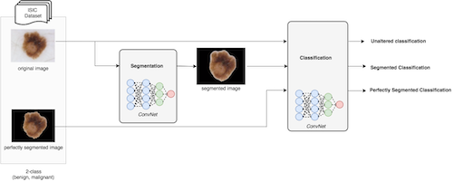
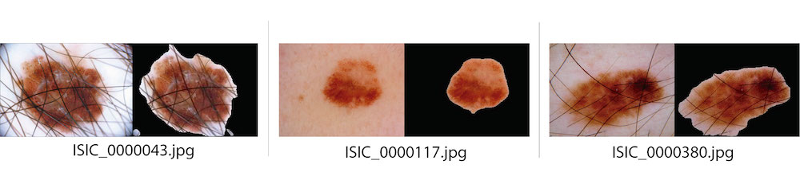
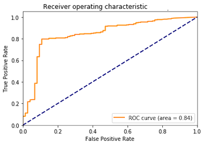

# Skin lesion detection from dermoscopic images using Convolutional Neural Networks

| ![Adria Romero Lopez][AdriaRomero-photo]  | ![Oge Marques][OgeMarques-photo]  |  ![Xavier Giro-i-Nieto][XavierGiro-photo] | 
|:-:|:-:|:-:|
| [Adria Romero-Lopez][AdriaRomero-web]  | [Oge Marques][OgeMarques-web]   |[Xavier Giro-i-Nieto][XavierGiro-web] | 

[AdriaRomero-web]: http://adriaromero.net/
[OgeMarques-web]: https://www.ogemarques.com/
[XavierGiro-web]: https://imatge.upc.edu/web/people/xavier-giro

[AdriaRomero-photo]: ./images/authors/adria.png 
[OgeMarques-photo]: ./images/authors/oge.png 
[XavierGiro-photo]: ./images/authors/xavier.png

A joint collaboration between:

| ![gpi-logo] | ![ceecs-logo] |
|:-:|:-:|
|[UPC - Image Processing Group][gpi-web] | [FAU - College of Engineering and Computer Science][ceecs-web]|
 
[gpi-web]: https://imatge.upc.edu/web/ 
[ceecs-web]: http://www.ceecs.fau.edu/

[gpi-logo]: ./images/logos/upc-imatge.png 
[ceecs-logo]: ./images/logos/fau-ceecs.png


## Abstract 

The recent emergence of machine learning and deep learning methods for medical image analysis has enabled the development 
of intelligent medical imaging-based diagnosis systems that can assist physicians in making better decisions about a 
patient’s health. In particular, skin imaging is a field where these new methods can be applied with a high rate of success.

This thesis focuses on the problem of automatic skin lesion detection, particularly on melanoma detection, by applying 
semantic segmentation and classification from dermoscopic images using a deep learning based approach. For the first 
problem, a U-Net convolutional neural network architecture is applied for an accurate extraction of the lesion region. 
For the second problem, the current model performs a binary classification (benign versus malignant) that can be used 
for early melanoma detection. The model is general enough to be extended to multi-class skin lesion classification. 
The proposed solution is built around the VGG-Net ConvNet architecture and uses the transfer learning paradigm. 
Finally, this work performs a comparative evaluation of classification alone (using the entire image) against a 
combination of the two approaches (segmentation followed by classification) in order to assess which of them achieves
 better classification results.
 
Experimental results for the classification task are encouraging: on the ISIC Archive dataset, the proposed method 
achieves an accuracy in the top three of the best previously published results. The experimental results of the 
segmentation evaluations demonstrate that the proposed method can outperform other state-of-the-art models.



**Keywords**: `Medical Image Analysis`, `Deep Learning`, `Medical Decision Support Systems`, 
`Convolutional Neural Networks`, `Transfer Learning`, `Machine Learning`, `Melanoma`, `Dermoscopy`, `Skin Lesions`,
`Skin Cancer`.

## Publications

### Skin Lesion Classification from Dermoscopic Images using Deep Learning Techniques. 

#### Abstract

The recent emergence of deep learning methods for medical image analysis has enabled the development of intelligent 
medical imaging-based diagnosis systems that can assist the human expert in making better decisions about a patients 
health. In this paper we focus on the problem of skin lesion classification, particularly early melanoma detection, 
and present a deep-learning based approach to solve the problem of classifying a dermoscopic image containing a skin 
lesion as malignant or benign. The proposed solution is built around the VGGNet convolutional neural network architecture 
and uses the transfer learning paradigm. Experimental results are encouraging: on the ISIC Archive dataset, the proposed 
method achieves a sensitivity value of 78.66%, which is significantly higher than the current state of the art on that 
dataset.

This is a paper for the [13th IASTED International Conference](https://www.iasted.org/conferences/pastinfo-852.html)
[[pdf]](https://ieeexplore.ieee.org/document/7893267)

Cite this publication with the following Bibtex code:

```
@inproceedings{lopez2017skin,
  title={Skin lesion classification from dermoscopic images using deep learning techniques},
  author={Lopez, Adria Romero and Giro-i-Nieto, Xavier and Burdick, Jack and Marques, Oge},
  booktitle={Biomedical Engineering (BioMed), 2017 13th IASTED International Conference on},
  pages={49--54},
  year={2017},
  organization={IEEE}
}
```

### The impact of segmentation on the accuracy and sensitivity of a melanoma classifier based on skin lesion images. 

#### Abstract

This work investigates the hypothesis that segmentation improves classification performance of skin lesions using 
convolutional  neural networks. Examination of classification using different degrees of segmentation on images from the 
ISIC Archive dataset with the VGG-16 architecture revealed unexpected results. Early results indicate that the highest 
classification performance occurs when a preclassification segmentation and an unconventional subsequent dilation of the 
segmentation region is performed.

This is a paper for the [Society of Imaging Informatics for Medicine 2017 Annual Meeting](https://siim.org/page/SIIM2017)
[[pdf]](https://imatge.upc.edu/web/sites/default/files/pub/cRomero-Lopeza.pdf)
[[slides]](https://www.slideshare.net/omarques/the-impact-of-segmentation-on-the-accuracy-and-sensitivity-of-a-melanoma-classifier-based-on-skin-lesion-images?ref=https://imatge.upc.edu/web/publications/impact-segmentation-accuracy-and-sensitivity-melanoma-classifier-based-skin-lesion)

Cite this publication with the following Bibtex code:

```
@inproceedings{burdick2017impact,
  title={The impact of segmentation on the accuracy and sensitivity of a melanoma classifier based on skin lesion images},
  author={Burdick, Jack and Marques, Oge and Romero-Lopez, Adri{\`a} and Gir{\'o} Nieto, Xavier and Weinthal, Janet},
  booktitle={SIIM 2017 scientific program: Pittsburgh, PA, June 1-June 3, 2017, David L. Lawrence Convention Center},
  pages={1--6},
  year={2017}
}
```

## Results

### Training the U-Net for Skin Lesion Segmentation

| Participant     | Rank  | Accuracy | Dice   | Jaccard    | Sensitivity | Specificity |
|-----------------|-------|----------|--------|------------|-------------|-------------|
| **Ours**           | **(1st)*** | 0.9176   | 0.8689 | **0.9176** | **0.9301**  | 0.9544      |
| Urko Sanchez    | 1st   | 0.953    | 0.910  | 0.843      | 0.910       | 0.965       |
| Lequan Yu       | 2nd   | 0.949    | 0.897  | 0.829      | 0.911       | 0.957       |
| Mahmudur Rahman | 3rd   | 0.952    | 0.895  | 0.822      | 0.880       | 0.969       |

(*) Participants from the [ISBI 2016 Challenge](https://challenge.kitware.com/#challenge/560d7856cad3a57cfde481ba) were 
ranked and awards granted based only on the Jaccard index. 

### U-Net segmentation results



### Classification results comparison


| Method                                    | Accuracy   | Sensitivity | Precision  |
|-------------------------------------------|------------|-------------|------------|
| Unaltered lesion classification           | **0.8469** | 0.8243      | 0.9523     |
| Perfectly segmented lesion classification | 0.8390     | 0.8648      | 0.9621     |
| Automatically segmented lesion class    | 0.8174     | **0.8918**  | **0.9681** |

### Automatically segmented lesion class ROC curve



## Awards

### **Best Bachelor Thesis Award** 
In the field of Telecommunications Engineering 2016-2017.

Date: Jun 2018

Location: Barcelona, Spain. 

| ![upc-logo] | ![telefonica-logo] |
|:-:|:-:|
|[UPC][upc-web] | [UPC Telefónica Catedra][upc-telefonica-web]|
 
[upc-web]: https://www.upc.edu/
[upc-telefonica-web]: https://catedratelefonica.upc.edu/es

[upc-logo]: ./images/logos/upc.png 
[telefonica-logo]: ./images/logos/telefonica.png


## Acknowledgements
I would like to thank Albert Gil and Josep Pujal from our technical support team at the Image Processing Group at UPC.

| ![AlbertGil-photo]  | ![JosepPujal-photo]  |
|:-:|:-:|
| [Albert Gil](AlbertGil-web)  |  [Josep Pujal](JosepPujal-web) |

[AlbertGil-photo]: https://github.com/imatge-upc/Class-Weighted-Convolutional-Features-for-Image-Retrieval/blob/master/authors/AlbertGil.jpg?raw=true "Albert Gil"
[JosepPujal-photo]:https://github.com/imatge-upc/Class-Weighted-Convolutional-Features-for-Image-Retrieval/blob/master/authors/JosepPujal.jpg?raw=true "Josep Pujal"

[AlbertGil-web]: https://imatge.upc.edu/web/people/albert-gil-moreno
[JosepPujal-web]: https://imatge.upc.edu/web/people/josep-pujal

## Contact

If you have any doubt about this work, please, do not hesitate to e-mail me at <mailto:adriaromero@me.com> or alternatively, 
reach me on [Twitter](https://twitter.com/adriaromero).
